# AI-DLC 自适应工作流概述

**目的**：为 AI 模型和开发人员提供完整工作流结构的技术参考。

**注意**：类似内容存在于 core-workflow.md（用户欢迎消息）和 README.md（文档）中。这种重复是有意的 - 每个文件服务于不同的目的：
- **本文件**：带有 Mermaid 图表的详细技术参考，用于 AI 模型上下文加载
- **core-workflow.md**：带有 ASCII 图表的面向用户的欢迎消息
- **README.md**：仓库的人类可读文档

## 三阶段生命周期：
• **INCEPTION 阶段**：规划和架构（工作区检测 + 条件阶段 + 工作流规划）
• **CONSTRUCTION 阶段**：设计、实施、构建和测试（每单元设计 + 代码规划/生成 + 构建和测试）
• **OPERATIONS 阶段**：未来部署和监控工作流的占位符

## 自适应工作流：
• **工作区检测**（始终）→ **逆向工程**（仅棕地）→ **需求分析**（始终，自适应深度）→ **条件阶段**（根据需要）→ **工作流规划**（始终）→ **代码生成**（始终，每单元）→ **构建和测试**（始终）

## 工作原理：
• **AI 分析**您的请求、工作区和复杂性以确定需要哪些阶段
• **这些阶段始终执行**：工作区检测、需求分析（自适应深度）、工作流规划、代码生成（每单元）、构建和测试
• **所有其他阶段都是条件性的**：逆向工程、用户故事、应用设计、单元生成、每单元设计阶段（功能设计、NFR 需求、NFR 设计、基础设施设计）
• **没有固定序列**：阶段按对您的特定任务有意义的顺序执行

## 您的团队角色：
• **回答问题**在专用问题文件中使用 [Answer]: 标签和字母选择（A、B、C、D、E）
• **选项 E 可用**：如果提供的选项不匹配，选择"其他"并描述您的自定义响应
• **作为团队工作**在继续之前审查和批准每个阶段
• **集体决定**在需要时确定架构方法
• **重要**：这是团队努力 - 为每个阶段涉及相关利益相关者

## AI-DLC 三阶段工作流：

```mermaid
flowchart TD
    Start(["用户请求"])
    
    subgraph INCEPTION["🔵 INCEPTION 阶段"]
        WD["工作区检测<br/><b>始终</b>"]
        RE["逆向工程<br/><b>条件性</b>"]
        RA["需求分析<br/><b>始终</b>"]
        Stories["用户故事<br/><b>条件性</b>"]
        WP["工作流规划<br/><b>始终</b>"]
        AppDesign["应用设计<br/><b>条件性</b>"]
        UnitsG["单元生成<br/><b>条件性</b>"]
    end
    
    subgraph CONSTRUCTION["🟢 CONSTRUCTION 阶段"]
        FD["功能设计<br/><b>条件性</b>"]
        NFRA["NFR 需求<br/><b>条件性</b>"]
        NFRD["NFR 设计<br/><b>条件性</b>"]
        ID["基础设施设计<br/><b>条件性</b>"]
        CG["代码生成<br/><b>始终</b>"]
        BT["构建和测试<br/><b>始终</b>"]
    end
    
    subgraph OPERATIONS["🟡 OPERATIONS 阶段"]
        OPS["运维<br/><b>占位符</b>"]
    end
    
    Start --> WD
    WD -.-> RE
    WD --> RA
    RE --> RA
    
    RA -.-> Stories
    RA --> WP
    Stories --> WP
    
    WP -.-> AppDesign
    WP -.-> UnitsG
    AppDesign -.-> UnitsG
    UnitsG --> FD
    FD -.-> NFRA
    NFRA -.-> NFRD
    NFRD -.-> ID
    
    WP --> CG
    FD --> CG
    NFRA --> CG
    NFRD --> CG
    ID --> CG
    CG -.->|下一个单元| FD
    CG --> BT
    BT -.-> OPS
    BT --> End(["完成"])
    
    style WD fill:#4CAF50,stroke:#1B5E20,stroke-width:3px,color:#fff
    style RA fill:#4CAF50,stroke:#1B5E20,stroke-width:3px,color:#fff
    style WP fill:#4CAF50,stroke:#1B5E20,stroke-width:3px,color:#fff

    style CG fill:#4CAF50,stroke:#1B5E20,stroke-width:3px,color:#fff
    style BT fill:#4CAF50,stroke:#1B5E20,stroke-width:3px,color:#fff
    style OPS fill:#BDBDBD,stroke:#424242,stroke-width:2px,stroke-dasharray: 5 5,color:#000
    style RE fill:#FFA726,stroke:#E65100,stroke-width:3px,stroke-dasharray: 5 5,color:#000
    style Stories fill:#FFA726,stroke:#E65100,stroke-width:3px,stroke-dasharray: 5 5,color:#000
    style AppDesign fill:#FFA726,stroke:#E65100,stroke-width:3px,stroke-dasharray: 5 5,color:#000

    style UnitsG fill:#FFA726,stroke:#E65100,stroke-width:3px,stroke-dasharray: 5 5,color:#000
    style FD fill:#FFA726,stroke:#E65100,stroke-width:3px,stroke-dasharray: 5 5,color:#000
    style NFRA fill:#FFA726,stroke:#E65100,stroke-width:3px,stroke-dasharray: 5 5,color:#000
    style NFRD fill:#FFA726,stroke:#E65100,stroke-width:3px,stroke-dasharray: 5 5,color:#000
    style ID fill:#FFA726,stroke:#E65100,stroke-width:3px,stroke-dasharray: 5 5,color:#000
    style INCEPTION fill:#BBDEFB,stroke:#1565C0,stroke-width:3px, color:#000
    style CONSTRUCTION fill:#C8E6C9,stroke:#2E7D32,stroke-width:3px, color:#000
    style OPERATIONS fill:#FFF59D,stroke:#F57F17,stroke-width:3px, color:#000
    style Start fill:#CE93D8,stroke:#6A1B9A,stroke-width:3px,color:#000
    style End fill:#CE93D8,stroke:#6A1B9A,stroke-width:3px,color:#000
    
    linkStyle default stroke:#333,stroke-width:2px
```

**阶段描述：**

**🔵 INCEPTION 阶段** - 规划和架构
- 工作区检测：分析工作区状态和项目类型（始终）
- 逆向工程：分析现有代码库（条件性 - 仅棕地）
- 需求分析：收集和验证需求（始终 - 自适应深度）
- 用户故事：创建用户故事和角色（条件性）
- 工作流规划：创建执行计划（始终）
- 应用设计：高级组件识别和服务层设计（条件性）
- 单元生成：分解为工作单元（条件性）

**🟢 CONSTRUCTION 阶段** - 设计、实施、构建和测试
- 功能设计：每单元的详细业务逻辑设计（条件性，每单元）
- NFR 需求：确定 NFR 并选择技术栈（条件性，每单元）
- NFR 设计：整合 NFR 模式和逻辑组件（条件性，每单元）
- 基础设施设计：映射到实际基础设施服务（条件性，每单元）
- 代码生成：使用第 1 部分 - 规划、第 2 部分 - 生成来生成代码（始终，每单元）
- 构建和测试：构建所有单元并执行全面测试（始终）

**🟡 OPERATIONS 阶段** - 占位符
- 运维：未来部署和监控工作流的占位符（占位符）

**关键原则：**
- 阶段仅在增加价值时执行
- 每个阶段独立评估
- INCEPTION 专注于"什么"和"为什么"
- CONSTRUCTION 专注于"如何"加上"构建和测试"
- OPERATIONS 是未来扩展的占位符
- 简单更改可能跳过条件性 INCEPTION 阶段
- 复杂更改获得完整的 INCEPTION 和 CONSTRUCTION 处理
