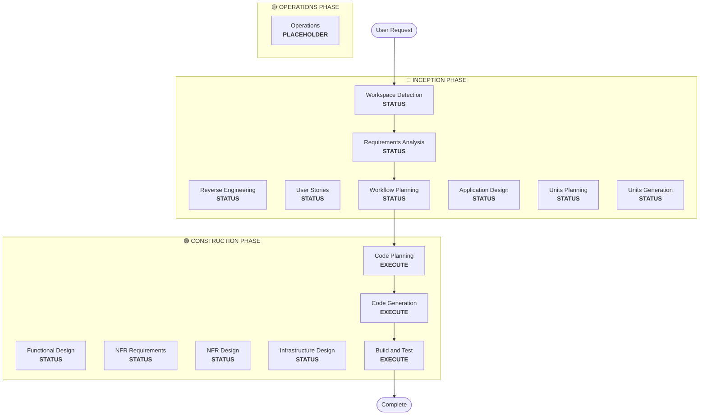

# 工作流规划

**目的**：确定要执行哪些阶段并创建全面的执行计划

**始终执行**：此阶段在理解需求和范围后始终运行

## 步骤 1：加载所有先前的上下文

### 1.1 加载逆向工程产物（如果是棕地项目）
- architecture.md
- component-inventory.md
- technology-stack.md
- dependencies.md

### 1.2 加载需求分析
- requirements.md（包括意图分析）
- requirement-verification-questions.md（带答案）

### 1.3 加载用户故事（如果已执行）
- stories.md
- personas.md

## 步骤 2：详细的范围和影响分析

**现在我们有了完整的上下文（需求 + 故事），执行详细分析：**

### 2.1 转换范围检测（仅限棕地项目）

**如果是棕地项目**，分析转换范围：

#### 架构转换
- **单组件变更** vs **架构转换**
- **基础设施变更** vs **应用程序变更**
- **部署模型变更**（Lambda→Container、EC2→Serverless 等）

#### 相关组件识别
对于转换，识别：
- 需要更新的**基础设施代码**
- 需要变更的 **CDK 堆栈**
- **API Gateway** 配置
- **负载均衡器**需求
- 所需的**网络**变更
- **监控/日志**适配

#### 跨包影响
- 需要更新的 **CDK 基础设施**包
- 需要版本更新的**共享模型**
- 需要端点变更的**客户端库**
- 需要新测试场景的**测试包**

### 2.2 变更影响评估

#### 影响领域
1. **面向用户的变更**：这是否影响用户体验？
2. **结构性变更**：这是否改变系统架构？
3. **数据模型变更**：这是否影响数据库模式或数据结构？
4. **API 变更**：这是否影响接口或契约？
5. **NFR 影响**：这是否影响性能、安全性或可扩展性？

#### 应用层影响（如果适用）
- **代码变更**：新入口点、适配器、配置
- **依赖项**：新库、框架变更
- **配置**：环境变量、配置文件
- **测试**：单元测试、集成测试

#### 基础设施层影响（如果适用）
- **部署模型**：Lambda→ECS、EC2→Fargate 等
- **网络**：VPC、安全组、负载均衡器
- **存储**：持久卷、共享存储
- **扩展**：自动扩展策略、容量规划

#### 运维层影响（如果适用）
- **监控**：CloudWatch、自定义指标、仪表板
- **日志**：日志聚合、结构化日志
- **告警**：告警配置、通知渠道
- **部署**：CI/CD 管道变更、回滚策略

### 2.3 组件关系映射（仅限棕地项目）

**如果是棕地项目**，创建组件依赖图：

```markdown
## Component Relationships
- **Primary Component**: [Package being changed]
- **Infrastructure Components**: [CDK/Terraform packages]
- **Shared Components**: [Models, utilities, clients]
- **Dependent Components**: [Services that call this component]
- **Supporting Components**: [Monitoring, logging, deployment]
```

对于每个相关组件：
- **Change Type**: Major, Minor, Configuration-only
- **Change Reason**: Direct dependency, deployment model, networking
- **Change Priority**: Critical, Important, Optional

### 2.4 风险评估

评估风险级别：
1. **低**：隔离变更，易于回滚，充分理解
2. **中**：多个组件，中等回滚，一些未知因素
3. **高**：系统范围影响，复杂回滚，重大未知因素
4. **关键**：生产关键，难以回滚，高度不确定性

## 步骤 3：阶段确定

### 3.1 用户故事 - 已执行还是跳过？
**已执行**：转到下一个确定
**未执行 - 执行如果**：
- 多个用户角色
- 用户体验影响
- 需要验收标准
- 需要团队协作

**跳过如果**：
- 内部重构
- 有明确重现的错误修复
- 技术债务减少
- 基础设施变更

### 3.2 应用设计 - 执行如果：
- 需要新组件或服务
- 需要定义组件方法和业务规则
- 需要服务层设计
- 需要澄清组件依赖关系

**跳过如果**：
- 在现有组件边界内的变更
- 没有新组件或方法
- 纯实现变更

### 3.3 设计（单元规划/生成）- 执行如果：
- 新数据模型或模式
- API 变更或新端点
- 复杂算法或业务逻辑
- 状态管理变更
- 多个包需要变更
- 需要基础设施即代码更新

**跳过如果**：
- 简单逻辑变更
- 仅 UI 变更
- 配置更新
- 直接的实现

### 3.4 NFR 实现 - 执行如果：
- 性能需求
- 安全考虑
- 可扩展性问题
- 需要监控/可观测性

**跳过如果**：
- 现有 NFR 设置足够
- 没有新的 NFR 需求
- 简单变更无 NFR 影响

## 步骤 4：注意自适应细节

**参见 [depth-levels.md](../common/depth-levels.md) 了解自适应深度说明**

对于将要执行的每个阶段：
- 将创建所有定义的产物
- 产物内的详细级别根据问题复杂性自适应
- 模型根据问题特征确定适当的详细程度

## 步骤 5：多模块协调分析（仅限棕地项目）

**如果是具有多个模块/包的棕地项目**，分析依赖关系并确定最佳更新策略：

### 5.1 分析模块依赖关系
- 检查构建系统依赖关系和依赖清单
- 识别构建时 vs 运行时依赖关系
- 映射模块之间的 API 契约和共享接口

### 5.2 确定更新策略
基于依赖分析，决定：
- **更新顺序**：由于依赖关系，哪些模块必须首先更新
- **并行化机会**：哪些模块可以同时更新
- **协调需求**：版本兼容性、API 契约、部署顺序
- **测试策略**：每个模块 vs 集成测试方法
- **回滚策略**：如果中途失败的恢复计划

### 5.3 记录协调计划
```markdown
## Module Update Strategy
- **Update Approach**: [Sequential/Parallel/Hybrid]
- **Critical Path**: [Modules that block other updates]
- **Coordination Points**: [Shared APIs, infrastructure, data contracts]
- **Testing Checkpoints**: [When to validate integration]
```

为每个受影响的模块识别：
- **Update priority**: Must-update-first vs can-update-later
- **Dependency constraints**: What it depends on, what depends on it
- **Change scope**: Major (breaking), Minor (compatible), Patch (fixes)

## 步骤 6：生成工作流可视化

创建 Mermaid 流程图显示：
- 所有阶段按顺序
- 每个条件阶段的 EXECUTE 或 SKIP 决定
- 每个阶段状态的适当样式

**样式规则**（在流程图后添加）：
```
style WD fill:#4CAF50,stroke:#1B5E20,stroke-width:3px,color:#fff
style CP fill:#4CAF50,stroke:#1B5E20,stroke-width:3px,color:#fff
style CG fill:#4CAF50,stroke:#1B5E20,stroke-width:3px,color:#fff
style BT fill:#4CAF50,stroke:#1B5E20,stroke-width:3px,color:#fff
style US fill:#BDBDBD,stroke:#424242,stroke-width:2px,stroke-dasharray: 5 5,color:#000
style Start fill:#CE93D8,stroke:#6A1B9A,stroke-width:3px,color:#000
style End fill:#CE93D8,stroke:#6A1B9A,stroke-width:3px,color:#000

linkStyle default stroke:#333,stroke-width:2px
```

**样式指南**：
- 已完成/始终执行：`fill:#4CAF50,stroke:#1B5E20,stroke-width:3px,color:#fff`（Material Green 白色文本）
- 条件 EXECUTE：`fill:#FFA726,stroke:#E65100,stroke-width:3px,stroke-dasharray: 5 5,color:#000`（Material Orange 黑色文本）
- 条件 SKIP：`fill:#BDBDBD,stroke:#424242,stroke-width:2px,stroke-dasharray: 5 5,color:#000`（Material Gray 黑色文本）
- 开始/结束：`fill:#CE93D8,stroke:#6A1B9A,stroke-width:3px,color:#000`（Material Purple 黑色文本）
- 阶段容器：使用较浅的 Material 颜色（INCEPTION：#BBDEFB，CONSTRUCTION：#C8E6C9，OPERATIONS：#FFF59D）

## 步骤 7：创建执行计划文档

创建 `aidlc-docs/inception/plans/execution-plan.md`：

```markdown
# Execution Plan

## Detailed Analysis Summary

### Transformation Scope (Brownfield Only)
- **Transformation Type**: [Single component/Architectural/Infrastructure]
- **Primary Changes**: [Description]
- **Related Components**: [List]

### Change Impact Assessment
- **User-facing changes**: [Yes/No - Description]
- **Structural changes**: [Yes/No - Description]
- **Data model changes**: [Yes/No - Description]
- **API changes**: [Yes/No - Description]
- **NFR impact**: [Yes/No - Description]

### Component Relationships (Brownfield Only)
[Component dependency graph]

### Risk Assessment
- **Risk Level**: [Low/Medium/High/Critical]
- **Rollback Complexity**: [Easy/Moderate/Difficult]
- **Testing Complexity**: [Simple/Moderate/Complex]

## Workflow Visualization



**注意**：将 STATUS 占位符替换为实际阶段状态（COMPLETED/SKIP/EXECUTE）并应用适当的样式

## Phases to Execute

### 🔵 INCEPTION PHASE
- [x] Workspace Detection (COMPLETED)
- [x] Reverse Engineering (COMPLETED/SKIPPED)
- [x] Requirements Elaboration (COMPLETED)
- [x] User Stories (COMPLETED/SKIPPED)
- [x] Execution Plan (IN PROGRESS)
- [ ] Application Design - [EXECUTE/SKIP]
  - **Rationale**: [Why executing or skipping]
- [ ] Units Planning - [EXECUTE/SKIP]
  - **Rationale**: [Why executing or skipping]
- [ ] Units Generation - [EXECUTE/SKIP]
  - **Rationale**: [Why executing or skipping]

### 🟢 CONSTRUCTION PHASE
- [ ] Functional Design - [EXECUTE/SKIP]
  - **Rationale**: [Why executing or skipping]
- [ ] NFR Requirements - [EXECUTE/SKIP]
  - **Rationale**: [Why executing or skipping]
- [ ] NFR Design - [EXECUTE/SKIP]
  - **Rationale**: [Why executing or skipping]
- [ ] Infrastructure Design - [EXECUTE/SKIP]
  - **Rationale**: [Why executing or skipping]
- [ ] Code Planning - EXECUTE (ALWAYS)
  - **Rationale**: Implementation approach needed
- [ ] Code Generation - EXECUTE (ALWAYS)
  - **Rationale**: Code implementation needed
- [ ] Build and Test - EXECUTE (ALWAYS)
  - **Rationale**: Build, test, and verification needed

### 🟡 OPERATIONS PHASE
- [ ] Operations - PLACEHOLDER
  - **Rationale**: Future deployment and monitoring workflows

## Package Change Sequence (Brownfield Only)
[If applicable, list package update sequence with dependencies]

## Estimated Timeline
- **Total Phases**: [Number]
- **Estimated Duration**: [Time estimate]

## Success Criteria
- **Primary Goal**: [Main objective]
- **Key Deliverables**: [List]
- **Quality Gates**: [List]

[IF brownfield]
- **Integration Testing**: All components working together
- **Operational Readiness**: Monitoring, logging, alerting working
```

## 步骤 8：初始化状态跟踪

更新 `aidlc-docs/aidlc-state.md`：

```markdown
# AI-DLC State Tracking

## Project Information
- **Project Type**: [Greenfield/Brownfield]
- **Start Date**: [ISO timestamp]
- **Current Stage**: INCEPTION - Workflow Planning

## Execution Plan Summary
- **Total Stages**: [Number]
- **Stages to Execute**: [List]
- **Stages to Skip**: [List with reasons]

## Stage Progress

### 🔵 INCEPTION PHASE
- [x] Workspace Detection
- [x] Reverse Engineering (if applicable)
- [x] Requirements Analysis
- [x] User Stories (if applicable)
- [x] Workflow Planning
- [ ] Application Design - [EXECUTE/SKIP]
- [ ] Units Planning - [EXECUTE/SKIP]
- [ ] Units Generation - [EXECUTE/SKIP]

### 🟢 CONSTRUCTION PHASE
- [ ] Functional Design - [EXECUTE/SKIP]
- [ ] NFR Requirements - [EXECUTE/SKIP]
- [ ] NFR Design - [EXECUTE/SKIP]
- [ ] Infrastructure Design - [EXECUTE/SKIP]
- [ ] Code Planning - EXECUTE
- [ ] Code Generation - EXECUTE
- [ ] Build and Test - EXECUTE

### 🟡 OPERATIONS PHASE
- [ ] Operations - PLACEHOLDER

## Current Status
- **Lifecycle Phase**: INCEPTION
- **Current Stage**: Workflow Planning Complete
- **Next Stage**: [Next stage to execute]
- **Status**: Ready to proceed
```

## 步骤 9：向用户呈现计划

```markdown
# 📋 Workflow Planning Complete

I've created a comprehensive execution plan based on:
- Your request: [Summary]
- Existing system: [Summary if brownfield]
- Requirements: [Summary if executed]
- User stories: [Summary if executed]

**Detailed Analysis**:
- Risk level: [Level]
- Impact: [Summary of key impacts]
- Components affected: [List]

**Recommended Execution Plan**:

I recommend executing [X] stages:

🔵 **INCEPTION PHASE:**
1. [Stage name] - *Rationale:* [Why executing]
2. [Stage name] - *Rationale:* [Why executing]
...

🟢 **CONSTRUCTION PHASE:**
3. [Stage name] - *Rationale:* [Why executing]
4. [Stage name] - *Rationale:* [Why executing]
...

I recommend skipping [Y] stages:

🔵 **INCEPTION PHASE:**
1. [Stage name] - *Rationale:* [Why skipping]
2. [Stage name] - *Rationale:* [Why skipping]
...

🟢 **CONSTRUCTION PHASE:**
3. [Stage name] - *Rationale:* [Why skipping]
4. [Stage name] - *Rationale:* [Why skipping]
...

[IF brownfield with multiple packages]
**Recommended Package Update Sequence**:
1. [Package] - [Reason]
2. [Package] - [Reason]
...

**Estimated Timeline**: [Duration]

> **📋 <u>**REVIEW REQUIRED:**</u>**  
> Please examine the execution plan at: `aidlc-docs/inception/plans/execution-plan.md`

> **🚀 <u>**WHAT'S NEXT?**</u>**
>
> **You may:**
>
> 🔧 **Request Changes** - Ask for modifications to the execution plan if required
> [IF any stages are skipped:]
> 📝 **Add Skipped Stages** - Choose to include stages currently marked as SKIP
> ✅ **Approve & Continue** - Approve plan and proceed to **[Next Stage Name]**
```

## 步骤 10：处理用户响应

- **如果批准**：进入执行计划中的下一阶段
- **如果请求变更**：更新执行计划并重新确认
- **如果用户想要强制包含/排除阶段**：相应更新计划

## 步骤 11：记录交互

在 `aidlc-docs/audit.md` 中记录：

```markdown
## Workflow Planning - Approval
**Timestamp**: [ISO timestamp]
**AI Prompt**: "Ready to proceed with this plan?"
**User Response**: "[User's COMPLETE RAW response]"
**Status**: [Approved/Changes Requested]
**Context**: Workflow plan created with [X] stages to execute

---
```
